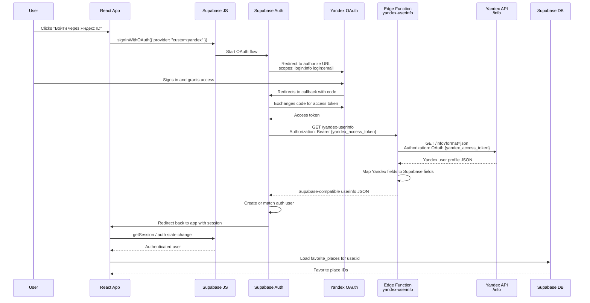

# Yandex Login Flow

This app uses Supabase Auth as the session layer and Yandex ID as a custom OAuth provider. The `yandex-userinfo` Edge Function adapts Yandex's user profile response into the shape Supabase expects.



## Property Mapping

| Yandex `/info` field | Supabase userinfo field |
| --- | --- |
| `id` | `sub` |
| `default_email` | `email` |
| first item from `emails` | fallback `email` |
| `real_name` | `name` |
| `display_name` | fallback `name` |
| `login` | fallback `name`, also `preferred_username` |
| `default_avatar_id` | `picture` URL |

## Header Mapping

Supabase Auth calls the Edge Function with the Yandex access token as a bearer token:

```text
Authorization: Bearer <yandex_access_token>
```

Yandex expects the same token with the `OAuth` authorization scheme:

```text
Authorization: OAuth <yandex_access_token>
```

The adapter exists because Yandex returns fields like `id` and `default_email`, while Supabase custom OAuth expects a userinfo response with fields like `sub` and `email`.
